# Gated Media Access

Put documents, media and posts behind access, and decide who gets in.

Access is given three ways: somebody pays for it on your site, an administrator
hands it over, or another system says they already paid. It is not a shop.
Payment is one of the three ways in.

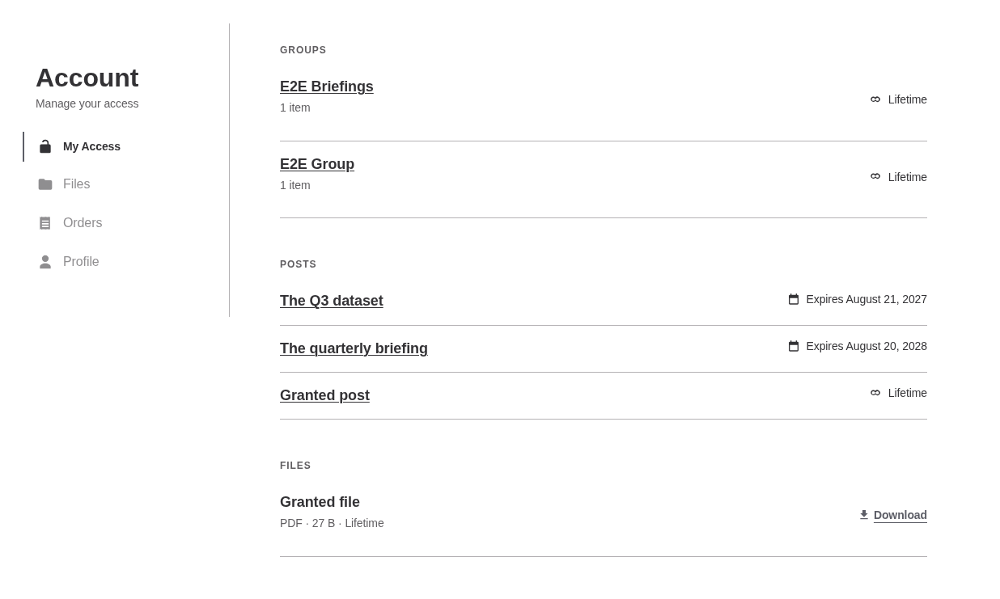

Every screen is in [`docs/`](docs/README.md).

## What you get

- **Restricted files, posts and pages.** A restricted file is moved out of
  reach and served only to holders. A restricted post is a hard 404 for
  everybody else, absent from listings, search, feeds, REST and sitemaps.
- **Groups.** Put content in a group and grant the group. Whatever the group
  holds today is what its holders can see today.
- **An account area** at `/account/`, where a person sees what they hold,
  downloads their files, reads their orders and keeps their profile.
- **Products.** A price, a duration and the things it grants. Buyers pay
  through Stripe Checkout, with coupons if you want them.
- **Timed or lifetime access**, with a warning email before it lapses and a
  daily sweep that keeps the admin lists honest.
- **Six notification emails**, every one switchable and rewritable.

## Requires

| | |
|---|---|
| PHP | **8.3** |
| WordPress | **6.4** |
| [`restrict-media-file-access`](https://github.com/a8cteam51/restrict-media-file-access) | **v1.4.2**, active |

That plugin owns the files: it moves them, serves them and refuses them, and
this one supplies the access decision. Without it, Gated Media Access shows a
notice and does nothing at all, because a plugin that looks alive while files
are served unprotected is worse than one that says plainly it is not working.

## Restricting content

Add a post, a page or a file to a group and it is restricted. Nothing else is
needed, and the marker that does it is applied for you.

Groups are made on one screen, so nothing can create one as a side effect of
saving a post. Each group says what it holds and who holds it.

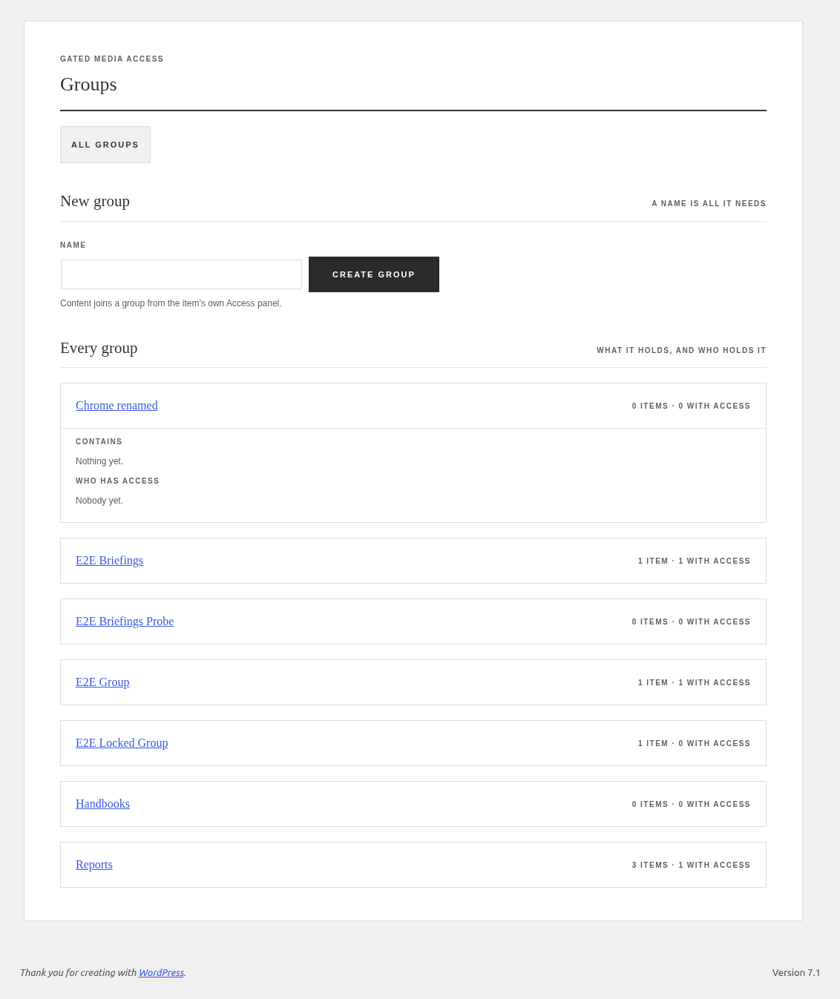

Every restrictable post, page and attachment gains an Access panel on its own
edit screen: who holds this item, which groups it is in, and a way to grant
somebody access on the spot. The posts and pages lists gain an Access column
counting holders, and quick edit can grant from there.

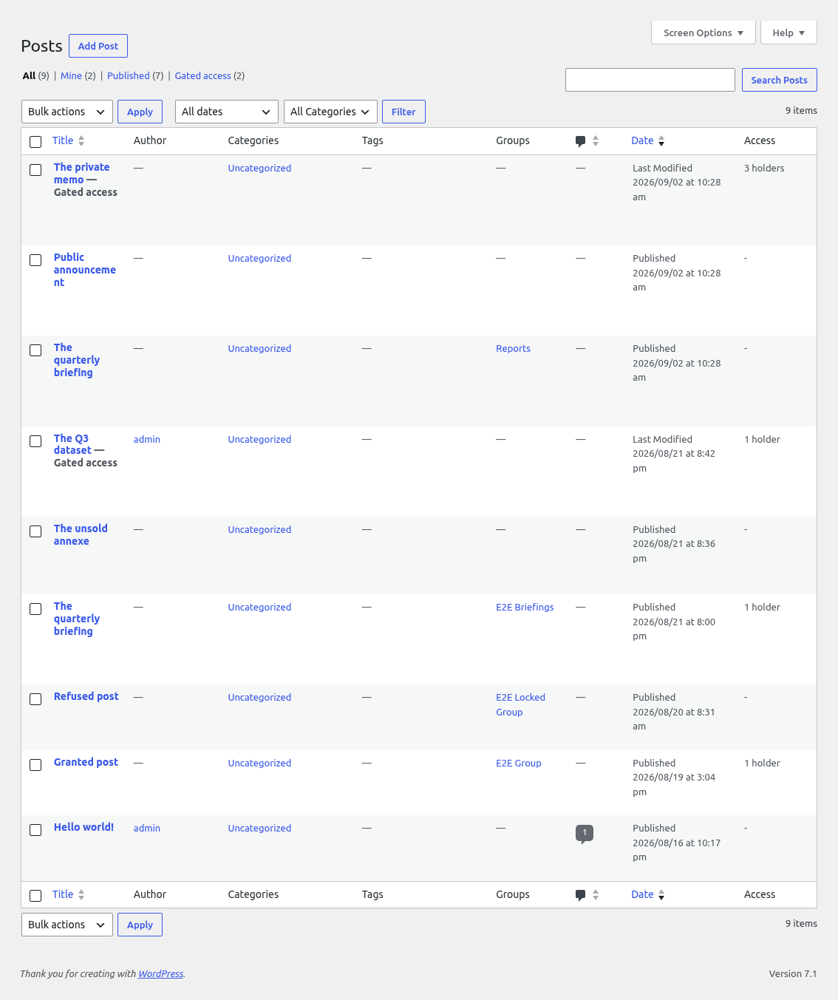

## Giving access by hand

Pick a person, pick an item, give it a duration. An empty duration is
lifetime.

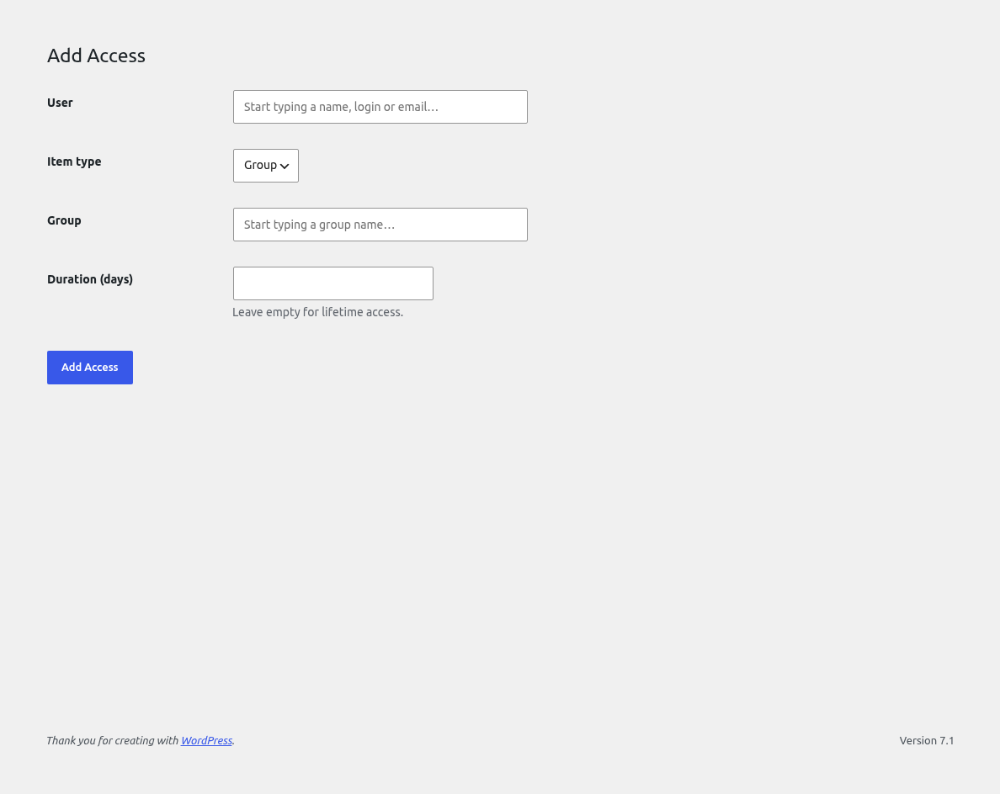

Every record is listed on the Access screen: who holds what, its status, when
it expires and where it came from. Filter by holder, item or source.

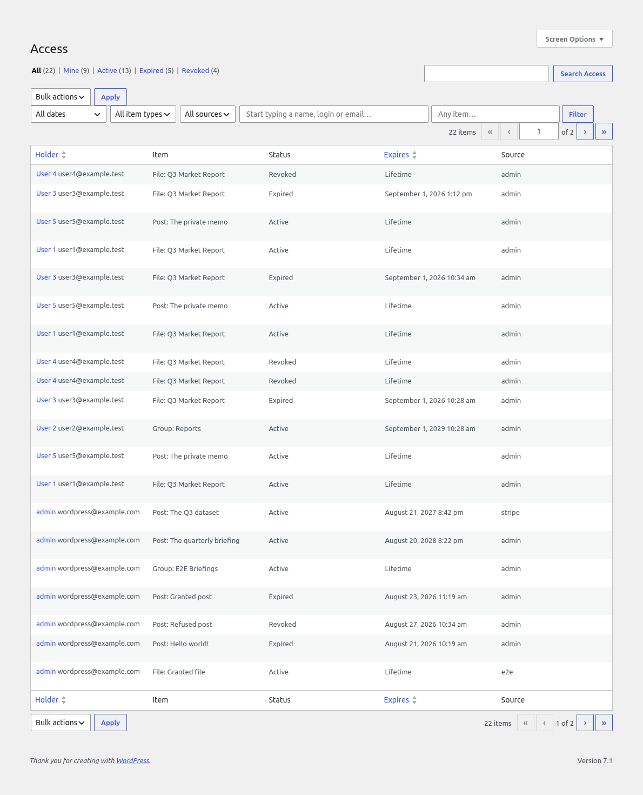

Editing a record means editing its expiry. Who holds it and what it points at
are its identity and do not change: to move either, grant again. A past date
expires it on the spot, a future date brings an expired record back, and a
revoked record stays revoked.

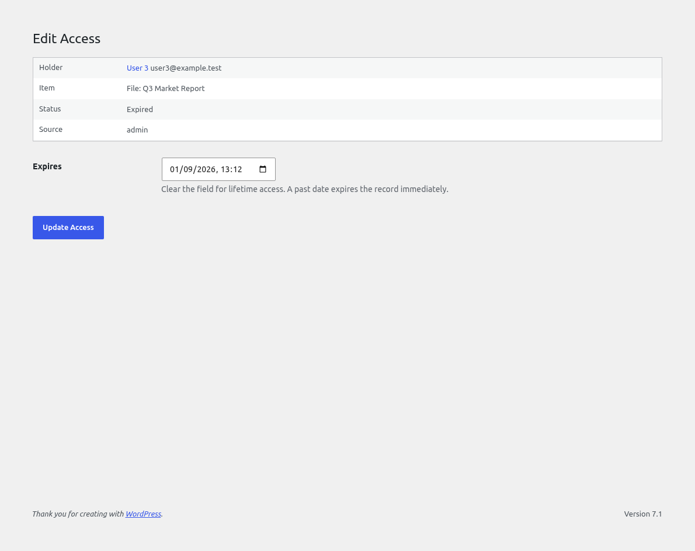

Revoke does one of three things, and you choose which in Settings: mark the
record revoked and keep the history, expire it now, or delete it outright.

## Selling access

A product is a price, a duration, the items it grants, and optionally a list
of addresses allowed to buy it. It is edited as one block on the product
itself.

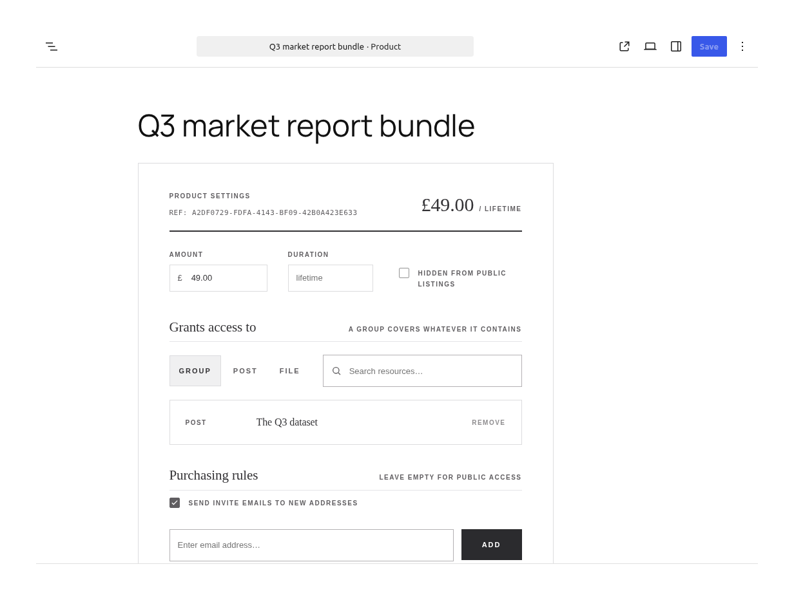

A product is reached at its own address, `/access/{uuid}`, and nowhere else.
Slugs and IDs answer 404, and products stay out of search, sitemaps and public
REST, so a product is found through a link you shared rather than by crawling
the site.

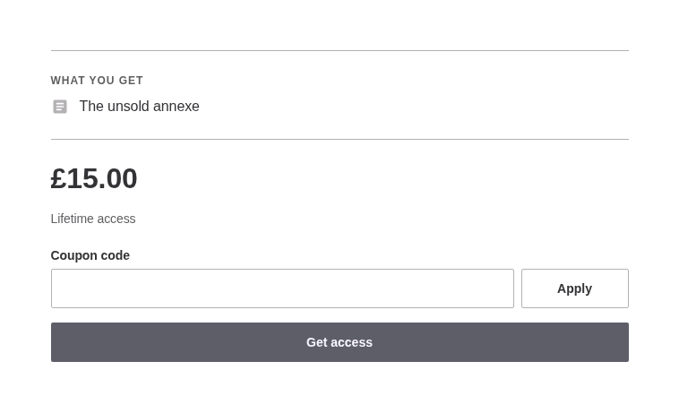

Buyers pay through Stripe Checkout. Access lands when Stripe confirms the
payment and at no other moment, so a closed browser mid-payment grants nothing
and a repeated confirmation grants nothing twice.

If a coupon takes the price to nothing, or the product is free, Stripe is not
involved at all.

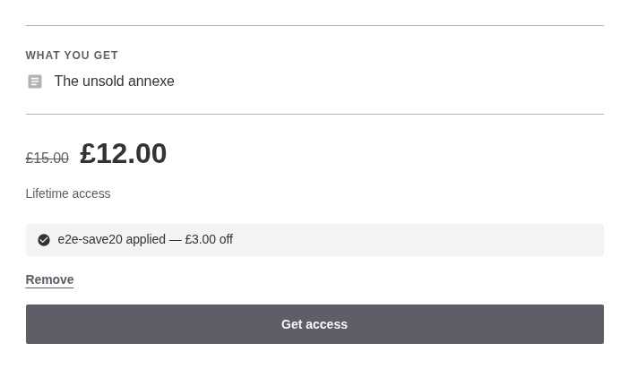

Apply shows what a code saves before anything is bought. The price shown and
the price charged are worked out by the same rules, and a coupon that runs out
between the two is refused at the till whatever the page said.

### They paid somewhere else

`POST /wp-json/gated-media-access/v1/access`, behind an application password
and the give-access capability, takes an email address, a target, a duration
and your own reference. The reference makes it safe to send twice.

## What a customer sees

The account area sits at `/account/`, on your own theme, with its own header,
navigation and footer left alone. Below 782px the sidebar becomes a scrolling
tab strip.

| | |
|---|---|
| 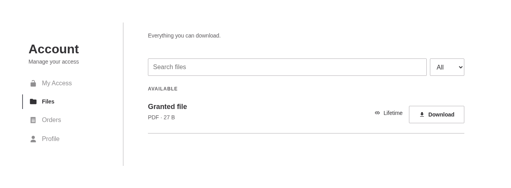 | 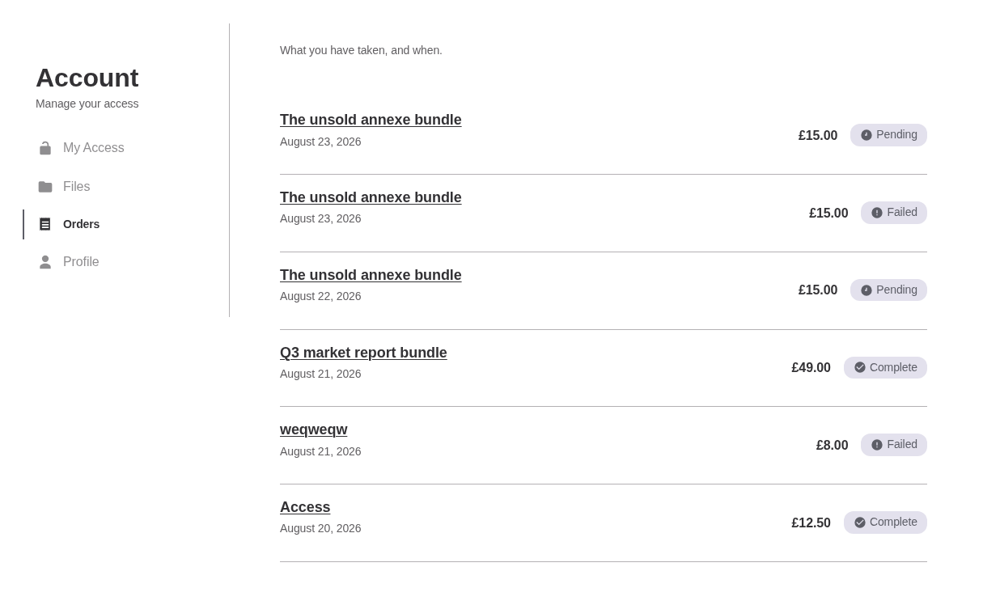 |
| Everything they can download | What they have bought |

An order shows what was paid, what it included at the time, and the access it
created. Coming back from Stripe before the confirmation has landed, the order
says it is confirming and watches for the answer rather than asking anyone to
reload.

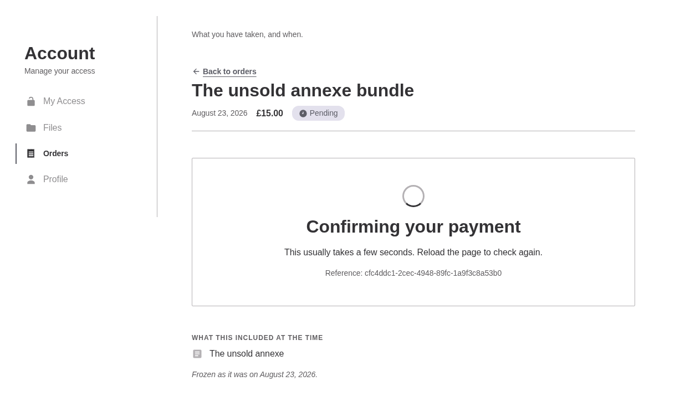

Signing in happens on your site, at `/sign-in/`, in four states: sign in, sign
up, reset and reset sent. wp-login.php is left exactly as it was.


## Settings

The shop currency, where products live, your Stripe keys, and what Revoke
does. A stored secret is never shown again: leave the field empty to keep it.

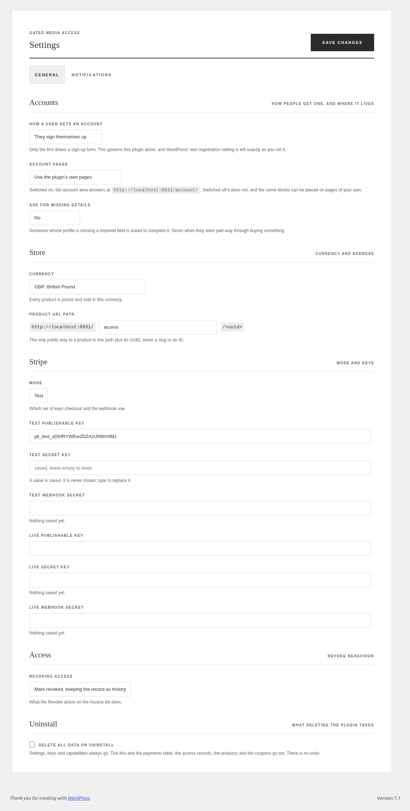

Notifications carry a switch, a subject and a body per email, with the tokens
each accepts. Nothing here is load-bearing: if no mail ever left the site,
access would still work exactly the same.

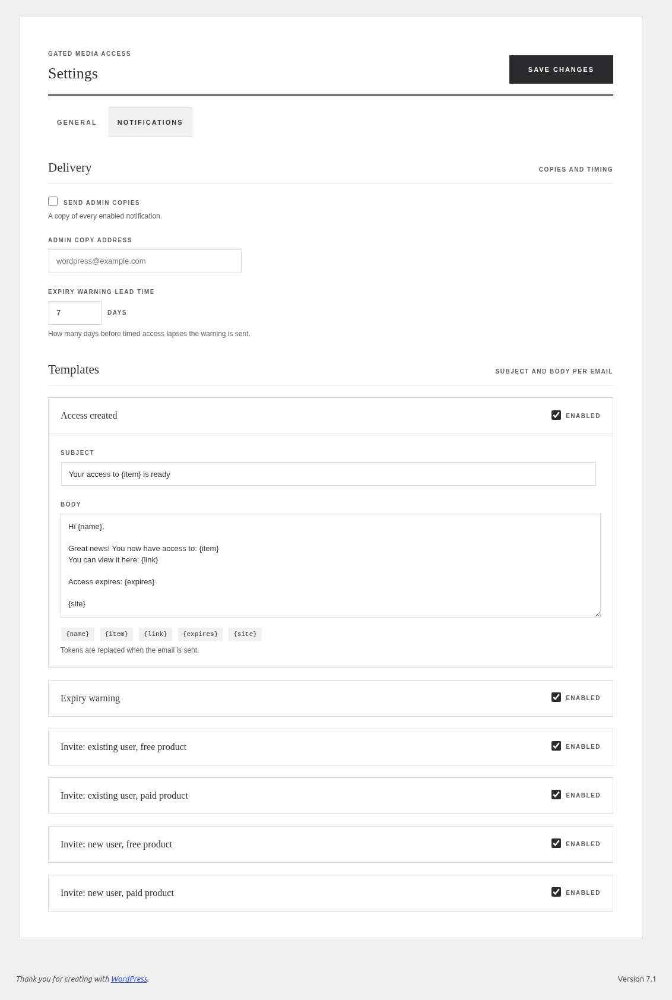

## Extending it

Forty-two filters and thirteen actions, all documented with examples in
[`docs/hooks.md`](docs/hooks.md). The four that matter most:

| | |
|---|---|
| `gatedmedia_user_can_access` | The last word on any access decision, asked by every boundary |
| `gatedmedia_account_sections` | Add a page to the account area |
| `gatedmedia_product_eligibility` | Decide who may buy a product, asked again on submit |
| `gatedmedia_notification_recipients` | Take over sending, or stop it |

A section is a slug, a title, a block and a position:

```php
add_filter(
    'gatedmedia_account_sections',
    function ( Section_Collection $sections ): Section_Collection {
        return $sections->add(
            new Section(
                slug:       'subscriptions',
                title:      __( 'Subscriptions', 'my-plugin' ),
                menu_label: __( 'Subscriptions', 'my-plugin' ),
                block:      'my-plugin/subscriptions',
                position:   25,
            )
        );
    }
);
```

That is the whole contract: no rewrite rule of your own, no query var, no menu
call, no flush. Reuse a slug to replace one of ours, or `remove()` to drop it.

The sixteen interface pieces the account area is built from are ordinary
blocks, so `render_block_gated-media-access/row` and its siblings let you
change how anything draws without a filter of ours.

## Development

```bash
composer test              # unit and integration
composer lint:php          # phpcs, phpstan, phpmd
npm run lint:js
npm run lint:style

npx wp-env start           # WordPress on :8931
npm run build
npm run test:e2e           # Playwright, at 1280px and 480px
```

The integration suite installs a real WordPress through `wp-phpunit` and needs
a database: copy `tests/.env_sample` to `tests/.env` first. The e2e suite runs
every spec at both sides of the 782px breakpoint, and builds its own fixtures.

CI runs on the local act runner from `.karkinos/workflows/`.

## Documentation

[`docs/`](docs/README.md) shows every screen, captured from a running site.

| | |
| --- | --- |
| [The account area](docs/account-area.md) | What a person holds, their files, their orders, their profile |
| [Buying access](docs/buying.md) | The product page, coupons, free products, and the wait for Stripe |
| [Signing in](docs/signing-in.md) | Sign in, sign up and password reset |
| [Administration](docs/administration.md) | Access records, groups, products, payments and settings |
