# The account area

Lives at `/account/`, and at `/account/{section}/` for each section. The four sections ship by default and a third party adds its own through `gatedmedia_account_sections`.

The nav is one list drawn two ways: a 256px column above 782px, a scrolling tab strip below it. Both are in the markup and CSS shows one, so the width decides and nothing is guessed server-side.

## My Access

Everything a person holds, in three lists: the groups, the posts and the files. Each row carries its expiry, and a group row says how many items it holds and opens on its own page.

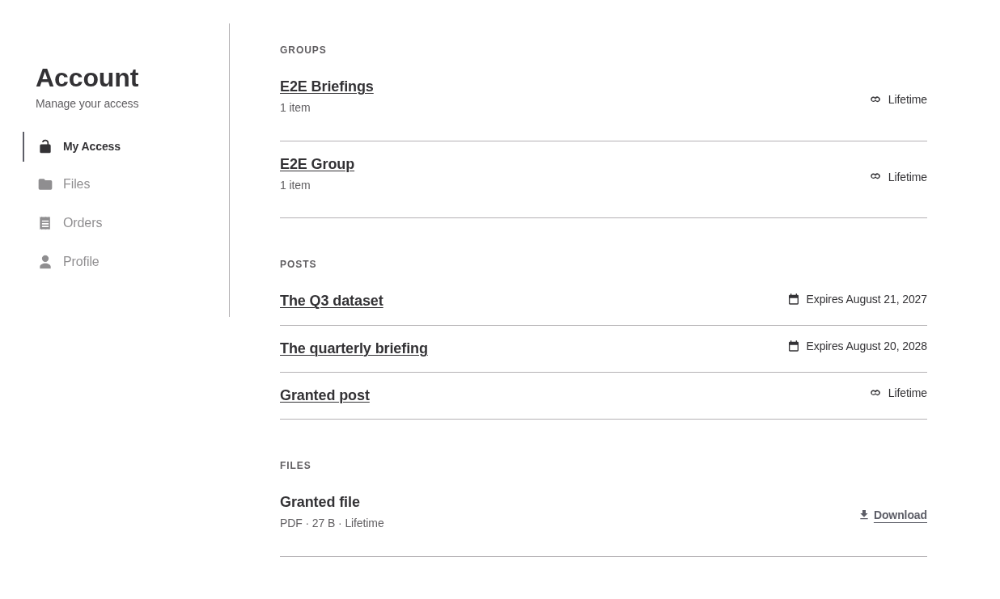

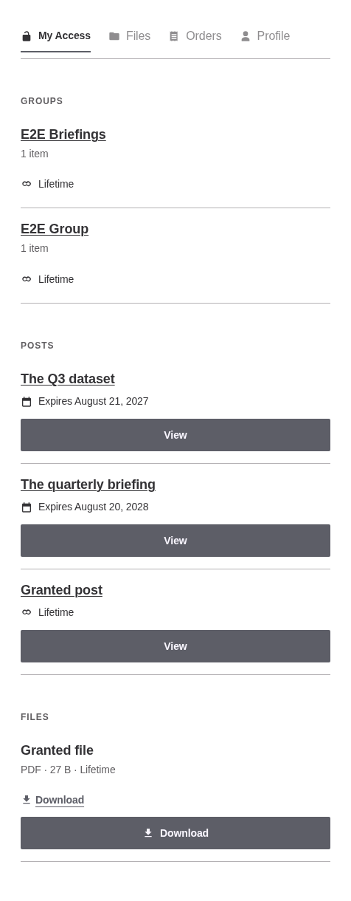

## One group, opened

A held group lists what it contains right now, not what it contained when access was granted, because an administrator moves things in and out of a group and the holder gets whatever is in it at the moment they ask.

A group nobody gave you reads exactly like a group that does not exist.

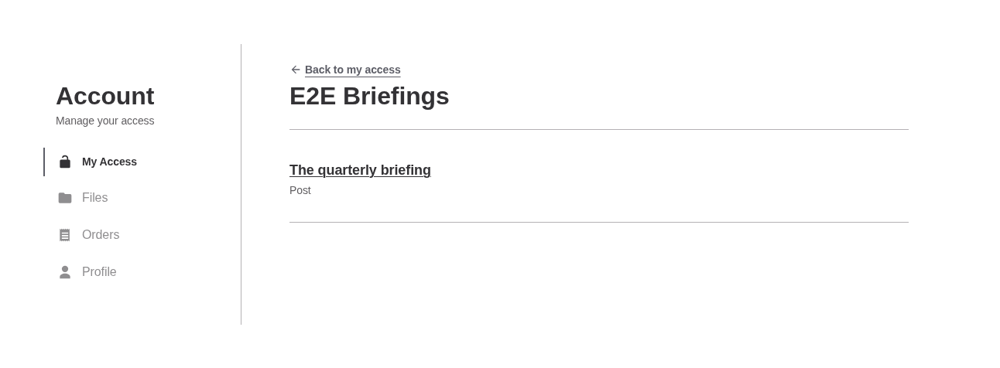

## Files

Everything downloadable, the contents of held groups included. Search and the type filter run against the rows already on the page, so nothing is fetched to filter, and with the script absent every row is simply shown.

Access that has run out moves to a past list, unless the file is still reachable another way.

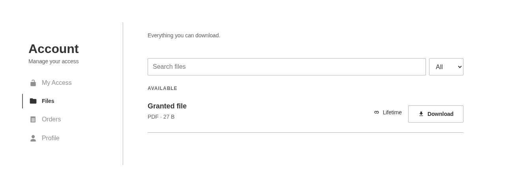

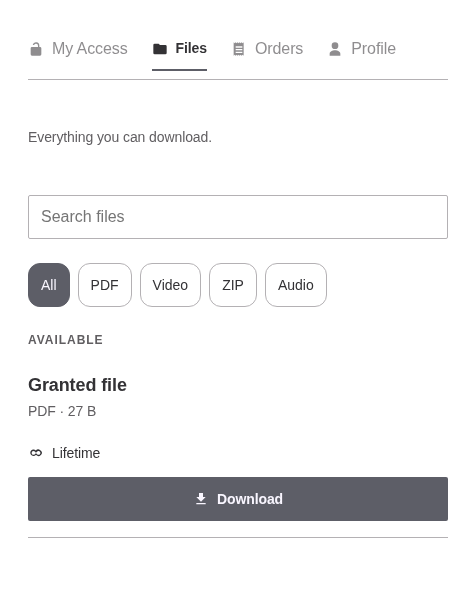

## Orders

The record of what was bought and when. Not a shop: one order's detail hangs off the list at `/account/orders/{uuid}`.

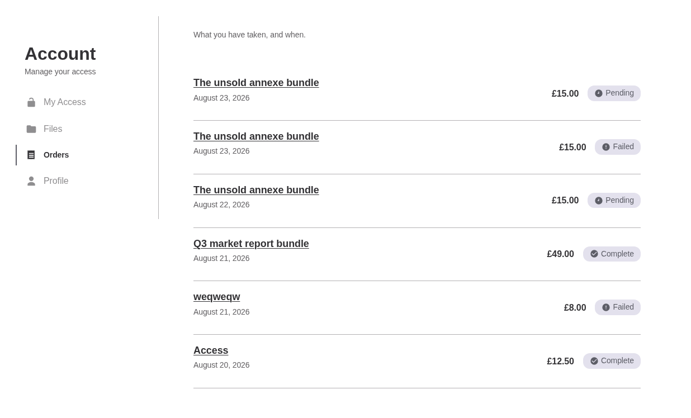

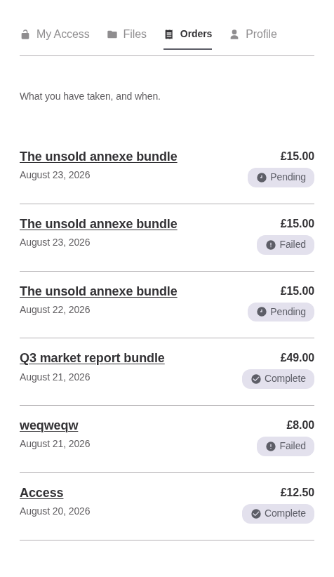

## One order

What was paid, what the order included at the time, and the access it created. The contents are the snapshot frozen at purchase, because groups are live and what they held that day is not recoverable later.

An order that is not yours reads as an order that never existed.

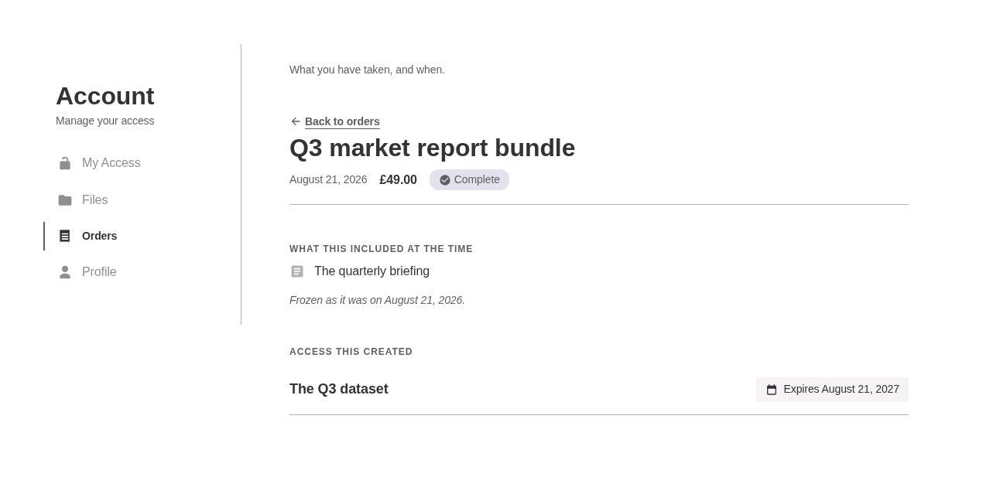

## An order still confirming

Stripe returns the buyer before its webhook has necessarily landed, so the order they arrive on can still be pending. The panel says so, claims nothing, and asks the status route until the answer changes.

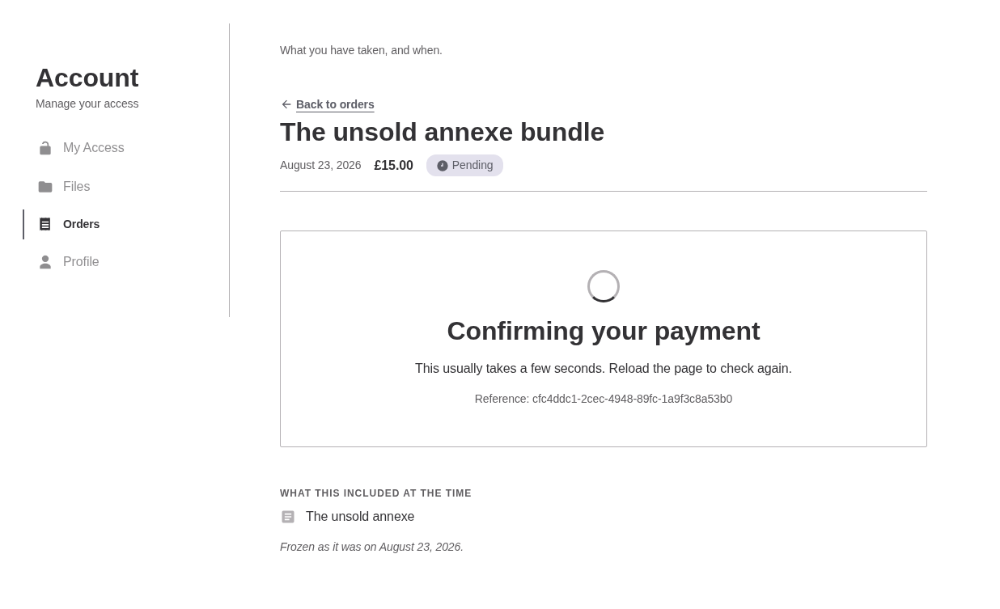

## Profile

The one profile shape every account-creation route fills, so somebody created by webhook is indistinguishable from somebody who signed up. Email identifies the account and is read-only here.

The form is three groups, in order: the email with first and last name, then the password, then contact details (company, phone, address, town or city, postcode, country). Each group is a plain `div.gatedmedia-profile-group--{key}` with no styles of its own, so the theme decides how they look, and a group is headed only when a site gives it a label.

A site reorders, adds or removes groups and fields with `gatedmedia_profile_fields`, and only the fields left in that list are saved. A field the site stores itself is shown with `gatedmedia_profile_values`, checked with `gatedmedia_profile_errors` and saved on `gatedmedia_profile_updated`. See [Hooks](hooks.md).

### Changing your password

The current password, then the new one twice. The current one is required (OWASP ASVS 5.0, 6.2.3), the new one needs at least 12 characters, and spaces at either end are dropped, as core's sign-in drops them. A missing or wrong current password, a short one or a mismatch saves nothing, and the reason shows under the field it is about.

A current password on its own, as a browser fills it in, changes nothing, so the rest of the form still saves.

The person stays signed in after a change, and core sends its password-changed email. An account made at purchase or by webhook was given a password nobody knows, so it sets one through the reset link on the [sign-in page](signing-in.md#reset) instead.

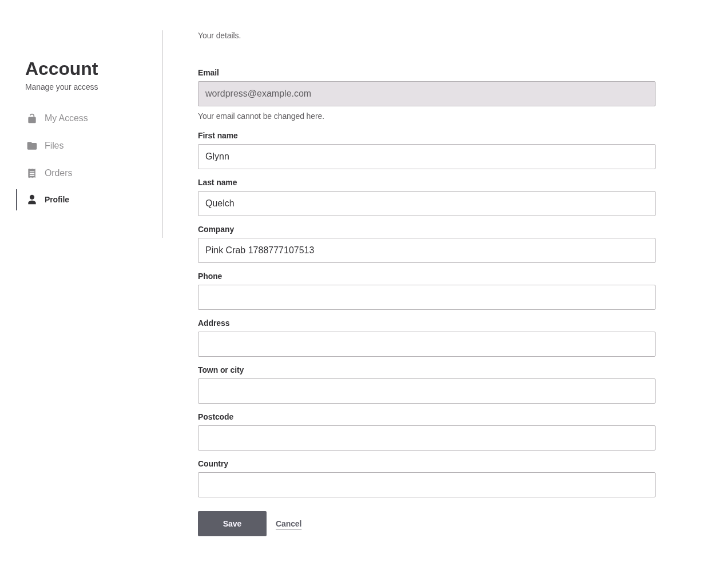

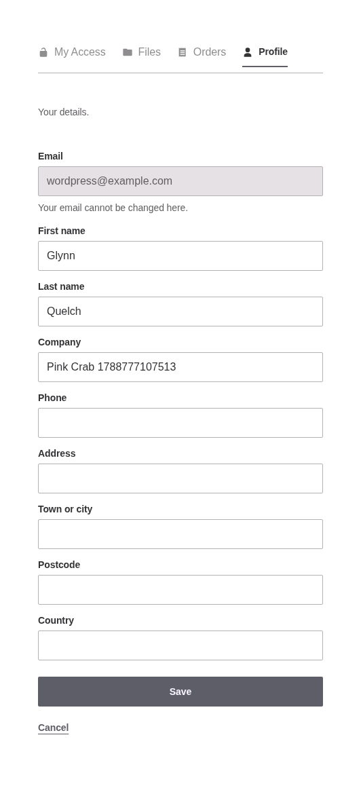
