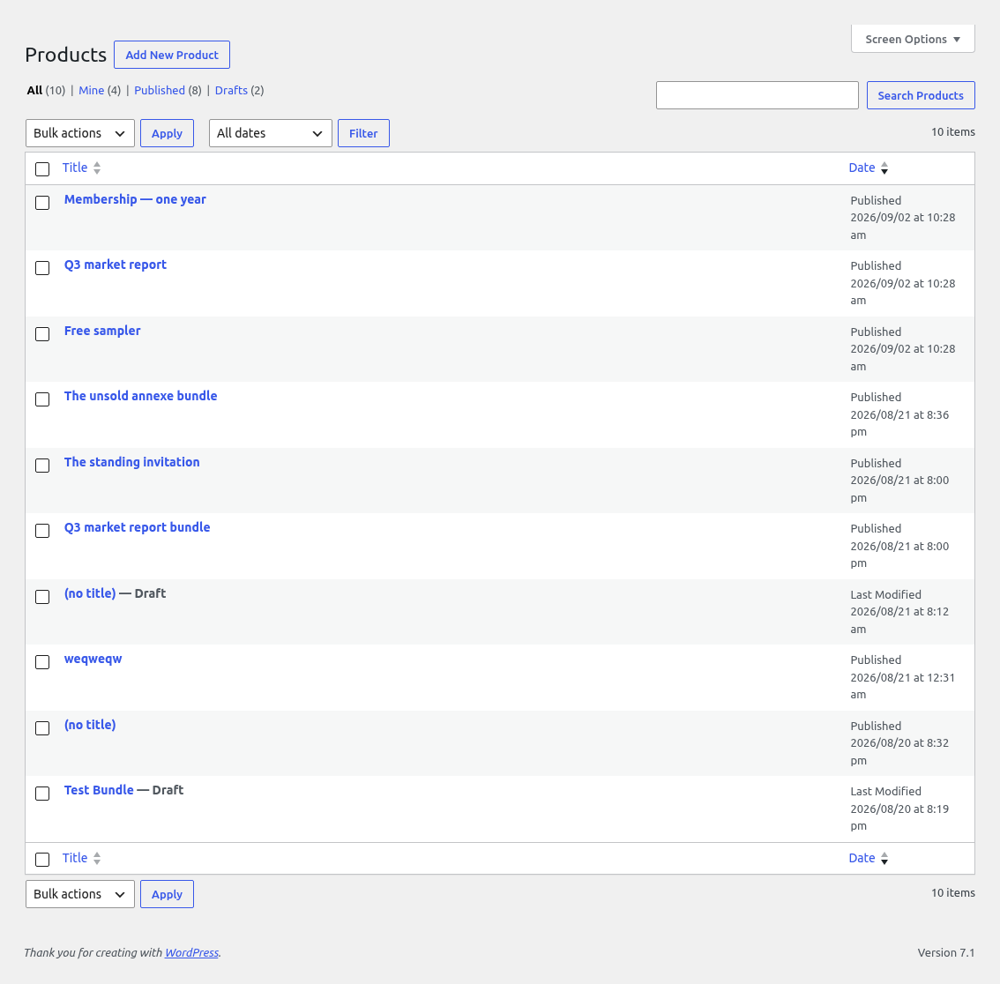
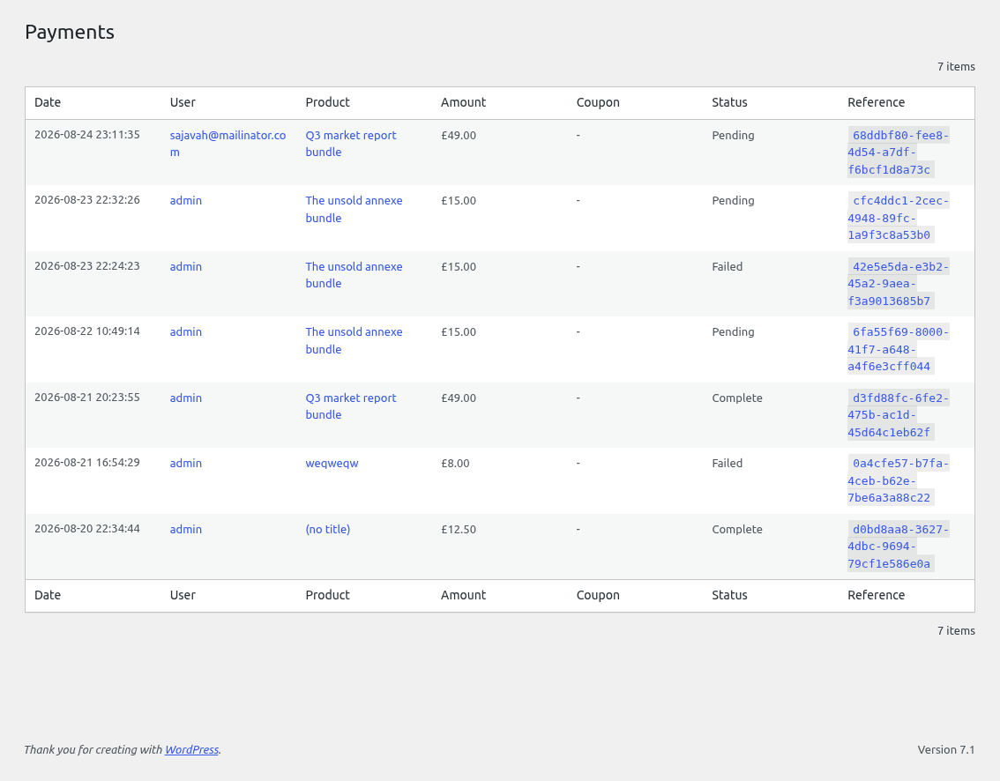
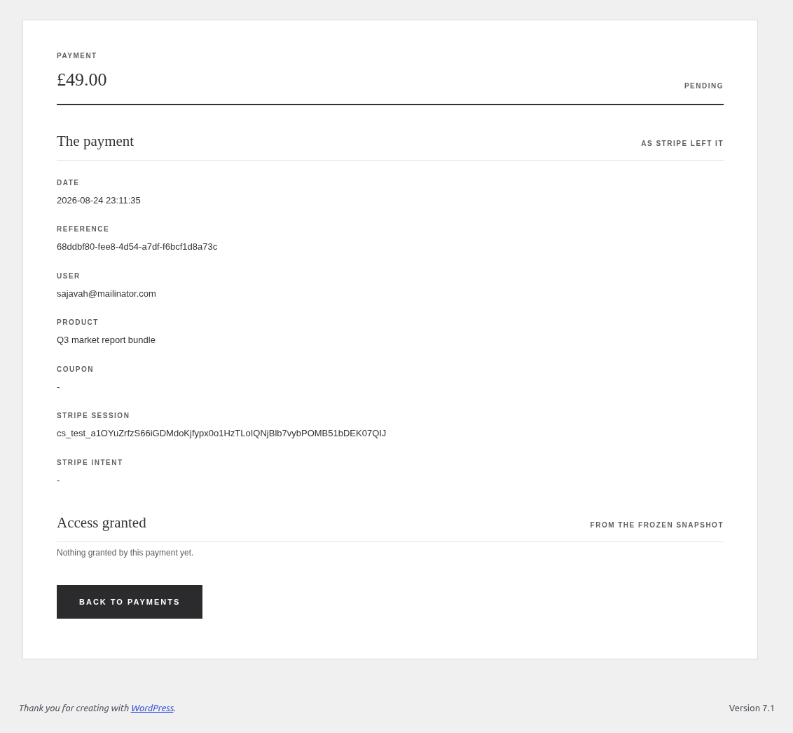

# Administration

Everything the plugin adds sits under one menu, Gated Access. No second top-level entry, and no screen of ours anywhere else.

## Access

Every record: who holds what, its status, when it expires and where it came from. The toolbar filters on the holder, the item and the source.

A record is data rather than content, so there is no editor for one. The row actions are Edit, which changes the expiry and nothing else, and Revoke.

## Add Access

Pick a person, pick an item, give it a duration. The form is the only admin door into a record, and the record itself is written by `Access_Writer`, the same class every other route goes through.

## Edit Access

One record's expiry, moved, cleared to lifetime, or pulled into the past. The status follows the date, and a revoked record refuses, because revocation is final and a fresh grant is the way back.

## Groups

A group holds content, and people hold the group. This screen is those two facts per group in one place: what it contains, and who has access to it.

Core's taxonomy screens are switched off, because they hung a Groups entry under Posts, Pages and Media and could only ever show a name, a slug and a misleading count.

## Access on an item

A post or a file's own edit screen carries one Access panel: who holds this item directly, each removable, and which groups it sits in, with add and remove right here.

An inline grant is staged in the form and applied when the item is saved, so pressing it never abandons an edit in progress.

## Products

A product is a price, a duration, the items it grants and an optional email allow-list. The form is one locked block on every product, saving straight to meta over REST.

## Payments

Every payment Stripe reported, read-only. The rows are the record of what happened and nothing here edits one.

One payment in full: the row's own facts, and the access its reference created.

## Settings

The shop currency, the product path, the Stripe mode and keys, the revoke behaviour, the account rules and the uninstall choice.

A stored secret is never echoed back: it renders as an empty field marked saved, and an empty submit keeps what is stored.

Notifications carry a switch, a subject and a body per type, with the tokens each one accepts.

