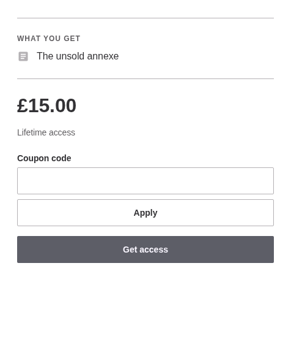
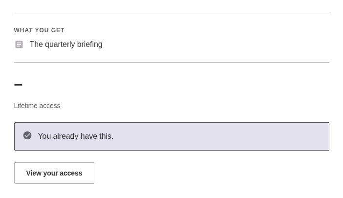
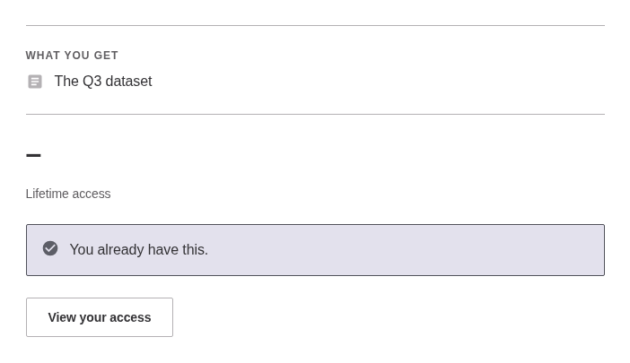

# Buying access

A product is a price, a duration and a list of things it grants. It is reached at `/{segment}/{uuid}` and nowhere else: never a slug, never an ID, and an attempt at either is a 404 rather than a redirect, which would tell a guesser the real URL.

## The product page

What it contains, what it costs, and the way in. The page draws one of six states, and the state decides what is offered rather than what is allowed: `Checkout` is asked again on submit, so a page offering a button it should not have still cannot buy anything.

Below 782px the buy action pins to the bottom of the viewport, with the price in the button's own label. It is the only pinned element anywhere, and it never appears on an account view.

## A coupon, applied

Apply reloads the page with the code on it and prices it through `Checkout::preview()`, which writes nothing and spends nothing. The old price stays visible, struck through, and the code rides the buy submit where the coupon is judged again.

A code that is not one says so in the field's own message and leaves the price alone.

## A free product

Free is not a zero-value order: it grants directly, writes no payment row, and never involves Stripe.

## Something already held

The page stops selling what a person already has, and points them at their access instead.

