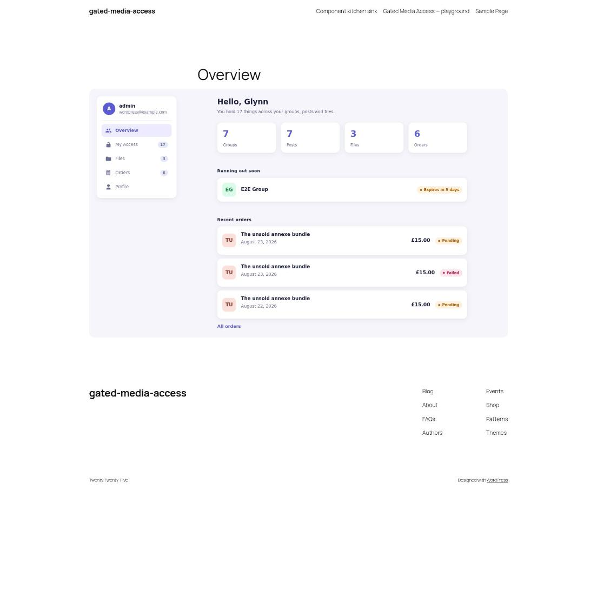

# Customising

Every part of the front end is a block rendered on the server and styled by one stylesheet, `gatedmedia-front`. So a plugin of your own can rebuild any component, add pages of its own and restyle the lot, without editing this plugin or the theme.

[gated-media-access-restyle](https://github.com/gin0115/gated-media-access-restyle) is a working example that uses all three ways in below. **[Try it in WordPress Playground](https://playground.wordpress.net/?blueprint-url=https://raw.githubusercontent.com/gin0115/gated-media-access-restyle/main/blueprint.json)**.

| Before | After |
| --- | --- |
|  |  |
|  |  |
|  |  |
|  |  |

It also adds a page of its own, first in the nav:



## Block filters

Core gives every block `render_block_data`, which changes its attributes before it renders, and `render_block_{name}`, which changes its markup after. The components go through `do_blocks()` whether the account route drew them or an editor placed them, so both filters reach every one.

A `render_block_{name}` callback gets the block's attributes, so it can rebuild the markup outright rather than patch it. A row's aside arrives already rendered in `$block['innerHTML']`.

```php
// Every row as a card with an initial tile.
add_filter(
	'render_block_gated-media-access/row',
	function ( string $content, array $block ): string {
		$title = (string) ( $block['attrs']['title'] ?? '' );

		// Loading and unavailable rows keep their own markup.
		if ( '' === $title || 'normal' !== ( $block['attrs']['state'] ?? 'normal' ) ) {
			return $content;
		}

		return sprintf(
			'<div class="gatedmedia-row my-card"><span class="my-card__tile">%s</span><div class="gatedmedia-row__main"><p class="gatedmedia-row__title">%s</p></div><div class="gatedmedia-row__aside">%s</div></div>',
			esc_html( mb_substr( $title, 0, 1 ) ),
			esc_html( $title ),
			$block['innerHTML']
		);
	},
	10,
	2
);
```

Keep `gatedmedia-row`, and `data-gatedmedia-type` where the row had one: the Files search and type filter find rows by them.

## The plugin's own filters

For what is drawn rather than how. A section is added with `gatedmedia_account_sections` and draws whatever block it names, and the data filters (`gatedmedia_my_access_data`, `gatedmedia_files_data`, `gatedmedia_orders_data`) hand that block the same lists the plugin's own views use. Position 5 puts it before My Access, so the account area lands on it.

```php
add_filter(
	'gatedmedia_account_sections',
	fn( Section_Collection $sections ): Section_Collection => $sections->add(
		new Section(
			slug:       'overview',
			title:      __( 'Overview', 'my-plugin' ),
			menu_label: __( 'Overview', 'my-plugin' ),
			block:      'my-plugin/overview',
			position:   5,
		)
	)
);
```

Every hook is in [Hooks](hooks.md).

## CSS

Colours, type, spacing and corners are `--gatedmedia-*` custom properties, declared inside `:where(:root)` so any rule of yours beats them. The components are `.gatedmedia-*` classes.

Add your CSS to the `gatedmedia-front` handle and it loads wherever a block does, after ours. The handle is registered on `init`, so attach after that:

```php
add_action(
	'init',
	function (): void {
		wp_add_inline_style( 'gatedmedia-front', file_get_contents( __DIR__ . '/styles.css' ) );
	},
	20
);
```

```css
:root {
	--gatedmedia-primary: #5b5bd6;
	--gatedmedia-radius: 10px;
}
```
