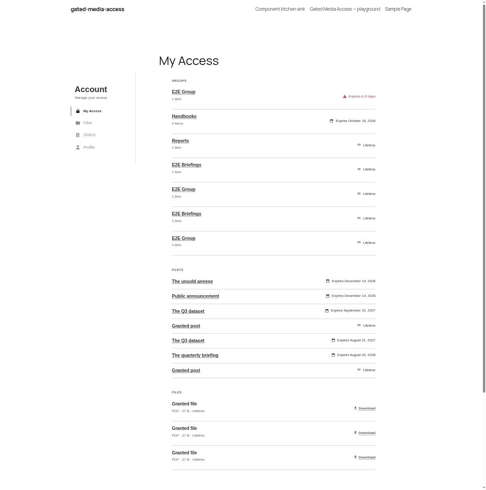
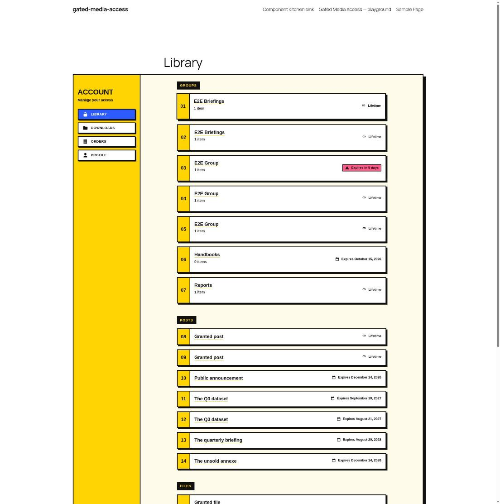
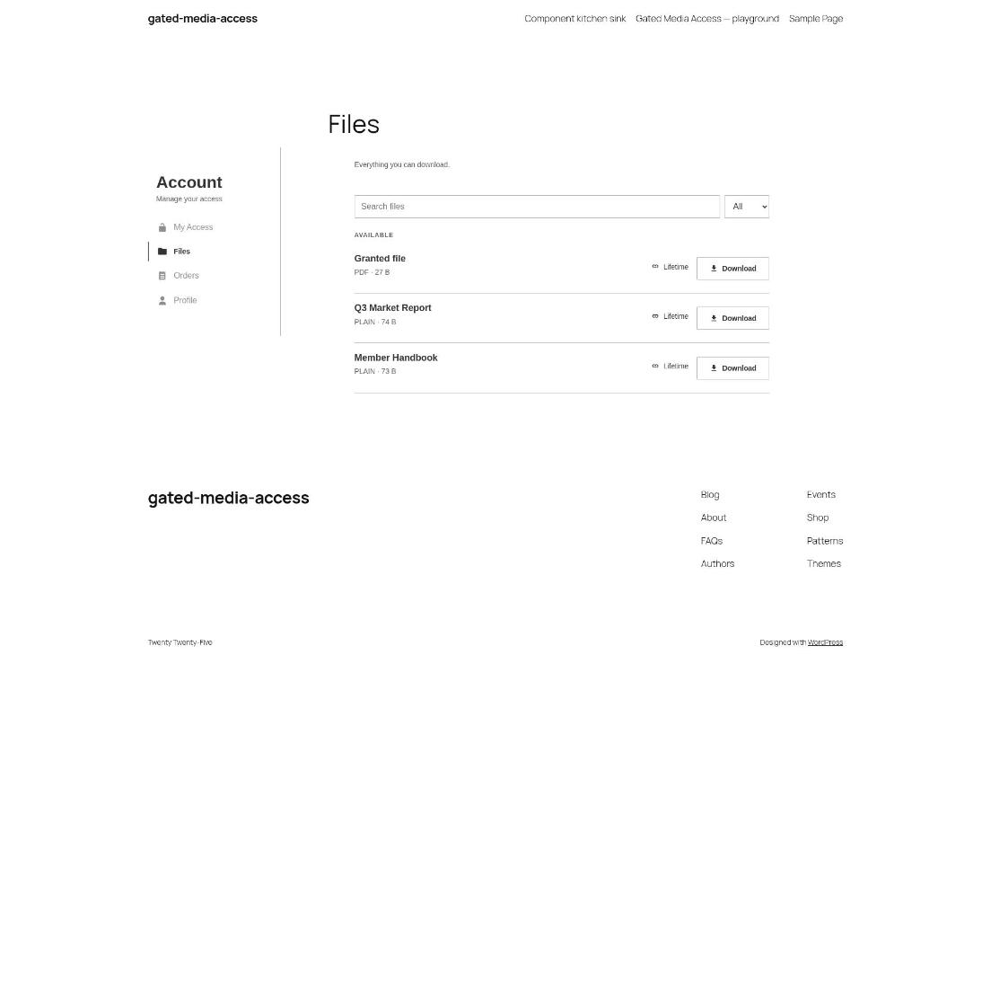
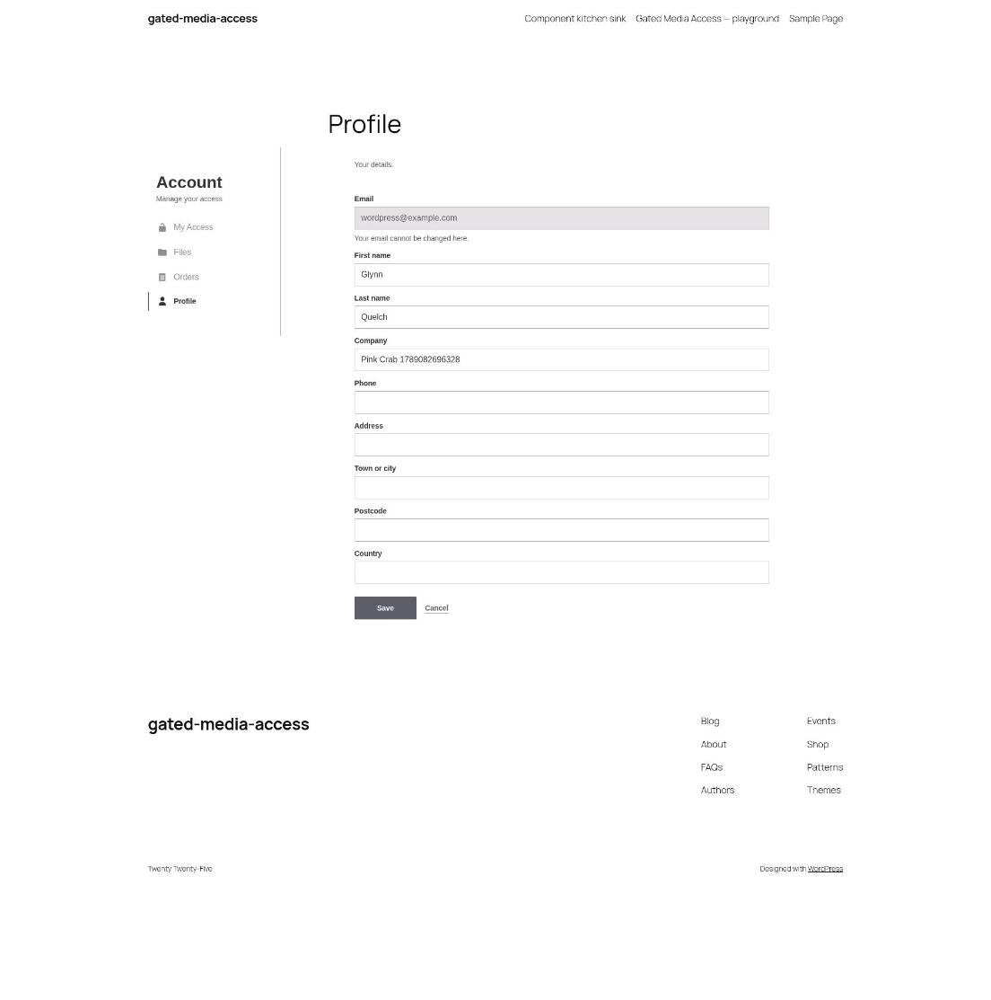
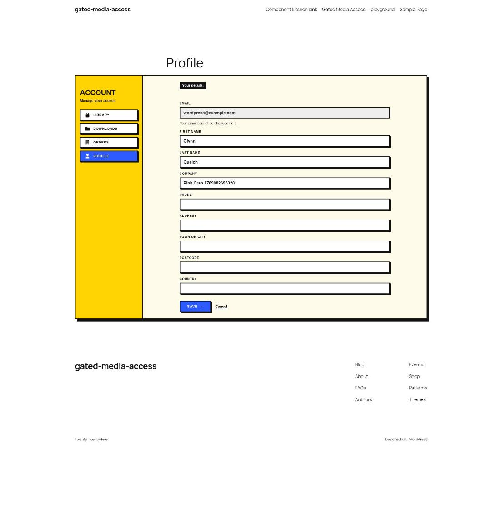

# Customising

Every part of the front end is a block rendered on the server and styled by one stylesheet, `gatedmedia-front`. So a plugin of your own can change how any of it looks and what it draws, without editing this plugin or the theme.

[gated-media-access-restyle](https://github.com/gin0115/gated-media-access-restyle) is a working example that uses all three ways in below. **[Try it in WordPress Playground](https://playground.wordpress.net/?blueprint-url=https://raw.githubusercontent.com/gin0115/gated-media-access-restyle/main/blueprint.json)**.

| Before | After |
| --- | --- |
|  |  |
|  |  |
|  |  |
|  |  |

## CSS

Colours, type, spacing and corners are `--gatedmedia-*` custom properties, declared inside `:where(:root)` so any rule of yours beats them. The components are `.gatedmedia-*` classes.

Add your CSS to the `gatedmedia-front` handle and it loads wherever a block does, after ours. The handle is registered on `init`, so attach after that:

```php
add_action(
	'init',
	function (): void {
		wp_add_inline_style( 'gatedmedia-front', file_get_contents( __DIR__ . '/styles.css' ) );
	},
	20
);
```

```css
:root {
	--gatedmedia-primary: #2d5bff;
	--gatedmedia-radius: 0;
}

.gatedmedia-row {
	border: 3px solid #111;
	box-shadow: 4px 4px 0 #111;
}
```

## Block filters

Core gives every block `render_block_data`, which changes its attributes before it renders, and `render_block_{name}`, which changes its markup after. The components go through `do_blocks()` whether the account route drew them or an editor placed them, so both filters reach every one.

```php
// A numbered tab on the front of every row.
add_filter(
	'render_block_gated-media-access/row',
	function ( string $content ): string {
		static $index = 0;

		return preg_replace(
			'/<div class="gatedmedia-row__main">/',
			sprintf( '<span class="my-row__index">%02d</span>$0', ++$index ),
			$content,
			1
		);
	}
);
```

```php
// Active access reads as Live, unless the caller gave its own label.
add_filter(
	'render_block_data',
	function ( array $block ): array {
		if ( 'gated-media-access/status-pill' === $block['blockName']
			&& 'active' === ( $block['attrs']['value'] ?? 'active' )
			&& '' === ( $block['attrs']['label'] ?? '' ) ) {
			$block['attrs']['label'] = 'Live';
		}

		return $block;
	}
);
```

## The plugin's own filters

For what is drawn rather than how: section names and order through `gatedmedia_account_sections`, the lists through the data filters, amounts through `gatedmedia_format_price`. Every one is in [Hooks](hooks.md).

```php
// £15.00 shows as £15.
add_filter(
	'gatedmedia_format_price',
	fn( string $formatted ): string => preg_replace( '/[.,]00(?!\d)/', '', $formatted )
);
```
