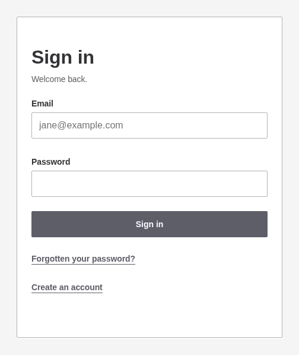
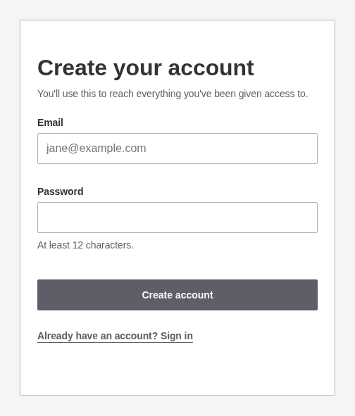
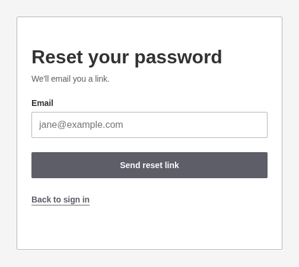
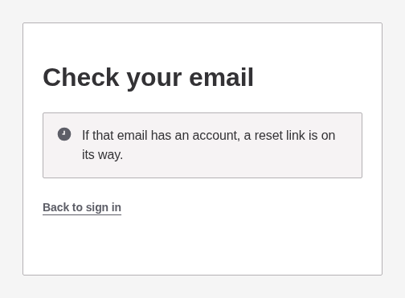

# Signing in

The plugin's own way in, on the site's own pages, at `/sign-in/`. One view in four states, so one URL with the state as a query argument.

wp-login.php is left entirely alone: not replaced, not filtered, not redirected. It keeps working, which makes it the way back if this page ever breaks, and core's reset link still lands there.

## Sign in

The bare URL. A failed attempt marks both fields rather than one, because marking one would say which half was wrong, and the address is carried back so nobody retypes it.

## Sign up

Drawn only where the site creates accounts on the front end. Under the admin and purchase routes the state is refused and the controls do not offer it, because a page must never advertise a route that does not exist.

An interrupted purchase carries its destination through, so a buyer lands back on the product they wanted.

## Reset

Asks for the address and nothing else, and hands off to core's own `retrieve_password()`.

## Reset link sent

The fields and the button are replaced by a confirmation, so a reload cannot send a second email. It says the same thing whether or not the address has an account.

